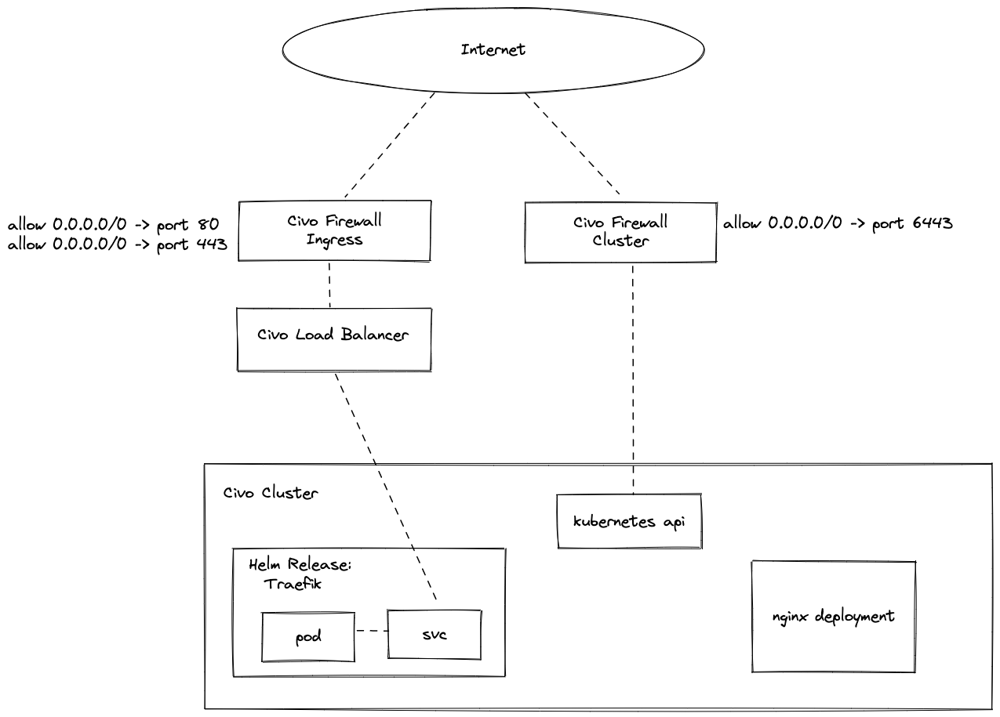

# terraform-template

Opinionated Template Repo for managing applications on a [Civo Kubernetes](https://www.civo.com) cluster.

## Quick Start

1. Create a new git repo from this template

2. Copy terraform.tfvars.example to terraform.tfvars

   ```bash
   cp terraform.tfvars.example terraform.tfvars
   ```

3. Update the variable in terraform.tfvars with your Civo API Key (Get your civo.com API key from your account at https://dashboard.civo.com/security)

4. Run `terraform init`

5. Run `terraform apply`

6. Check the state of the pods in the cluster using:

   ```yaml
   KUBECONFIG=`pwd`/kubeconfig kubectl get po -A
   ```

7. Visit the nginx pod using the ingress

8. > TODO: a terraform Kubernetes service with Traefik annotation pointed to the nginx deployment is required

## High-Level Design

This is an overview of the infrastructure being managed by this repo.



## Terraform Provider Documentation

* https://registry.terraform.io/providers/civo/civo/1.0.21
* https://registry.terraform.io/providers/hashicorp/helm/2.6.0
* https://registry.terraform.io/providers/hashicorp/kubernetes/2.11.0
* https://registry.terraform.io/providers/hashicorp/local/2.2.3

## Variables

| Name | Type | Description | Default |
|------|------|-------------|---------|
| civo_token | string | API Token for civo.com | "" |
| region | string | The Civo Region to provision against | FRA1 |
| kubernetes_api_access |  list | list of IP addresses / subnets to allow access to the cluster api | [ "0.0.0.0/0" ] |
| cluster_web_access | list | list of IP addresses / subnets to allow access to port 80 | [ "0.0.0.0/0" ] |
| cluster_websecure_access | list | list of IP addresses / subnets to allow access to port 443 | [ "0.0.0.0/0" ] |

## Contribution Guide

Please see [CONTRIBUTING.md](contributing.md)


### Development Setup

While this is a template repository, it can be checked out and contributed to
as a bare git repo. As such, making changes to this is as simple as a git clone
and following the `Quick Start` steps above.


**Testing**

Testing of the base assets have been added using `teratest`  by gruntwork.

```
> go test -v .
=== RUN   TestCluster
....
--- PASS: TestCluster (172.23s)
PASS
ok  	github.com/civo/terraform-template	172.589s
```

This will provision real resources and run tests against them (e.g. ensuring
the number of nodes requested have been created correctly). Resources will
automatically be cleaned up at the end of the test run.

## Acknowledgements

- [Hashicorp](https://www.hashicorp.com)
- [Excalidraw](https://github.com/excalidraw/excalidraw)
- [Terratest](https://terratest.gruntwork.io)